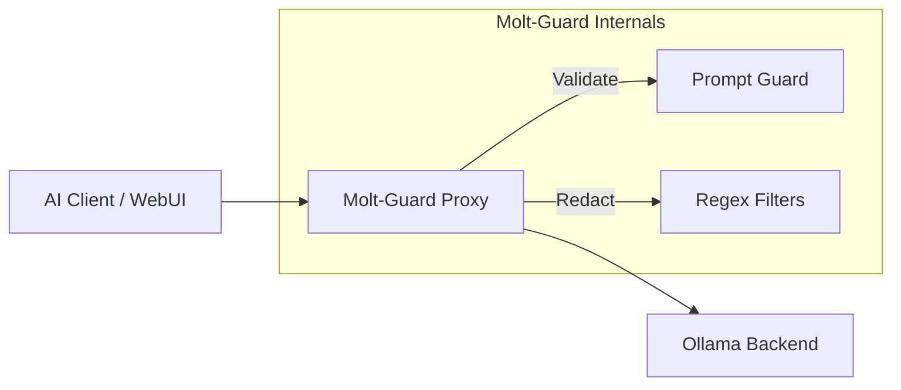
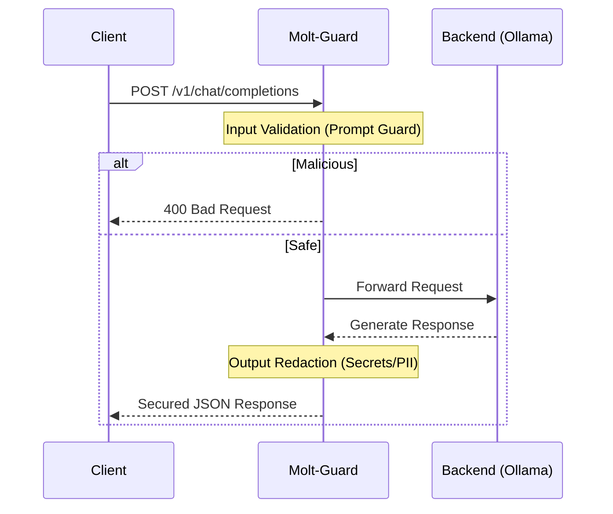

# 🛡️ Molt-Guard

**Molt-Guard** is a high-performance, hardened security proxy written in Rust. It adds a critical layer of defense between your AI clients (like Open WebUI) and your LLM backends (like Ollama), providing automated prompt injection protection and output redaction for sensitive data.

## 🚀 Key Features

- **OpenAI-Compatible:** Seamlessly integrates with any client that expects the standard OpenAI API.
- **Prompt Injection Defense:** Leverages the `Prompt Guard` model to block malicious inputs before they reach your backend.
- **Configurable Sensitivity:** Choose from `Low`, `Medium`, or `High` protection levels to match your security requirements.
- **Output Redaction:** Automatically detects and redacts Secrets (API keys, tokens) and PII (Emails, Phone Numbers) using high-speed regex engines.
- **Transparent Fallback:** Forwards non-chat requests (like model management) transparently to the backend, ensuring full compatibility with tools like Open WebUI.
- **Hardened Infrastructure:** Built on Google's Distroless base image with non-root user execution and a read-only filesystem.

## 📐 System Architecture



## 🔒 Security Flow



## 🛠️ Quick Start

1.  **Clone and Configure:**
    ```bash
    cp .env.example .env
    # Edit .env to point to your Ollama backend
    ```

2.  **Launch with Docker:**
    ```bash
    docker-compose up -d --build
    ```

3.  **Use in your Client:**
    Point your AI tool's API URL to `http://localhost:3005`.

## 🛡️ Security Audit & Hardening

Molt-Guard is designed with a "Security-First" philosophy:

| Measure | Implementation |
| :--- | :--- |
| **Language** | Rust (Memory safety, no garbage collection pauses) |
| **Base Image** | `gcr.io/distroless/cc-debian12` (Minimal attack surface) |
| **Execution** | Runs as `nonroot` user |
| **Filesystem** | `read_only: true` (Prevents persistence of exploits) |
| **Privileges** | `no-new-privileges: true` (Mitigates privilege escalation) |
| **Capabilities** | `cap_drop: ALL` (Strictly limited system access) |

## ⚙️ Configuration

| Variable | Default | Description |
| :--- | :--- | :--- |
| `OLLAMA_URL` | `http://ollama:11434` | The internal/external URL of your Ollama instance. |
| `PROMPT_SENSITIVITY` | `Medium` | `Low`, `Medium`, or `High` sensitivity for injection detection. |
| `VALIDATION_MODE` | `Remote` | `Remote` (Uses Ollama model) or `Local` (Basic patterns). |

## 📄 License

MIT © 2026 Molt-Guard Contributors.
